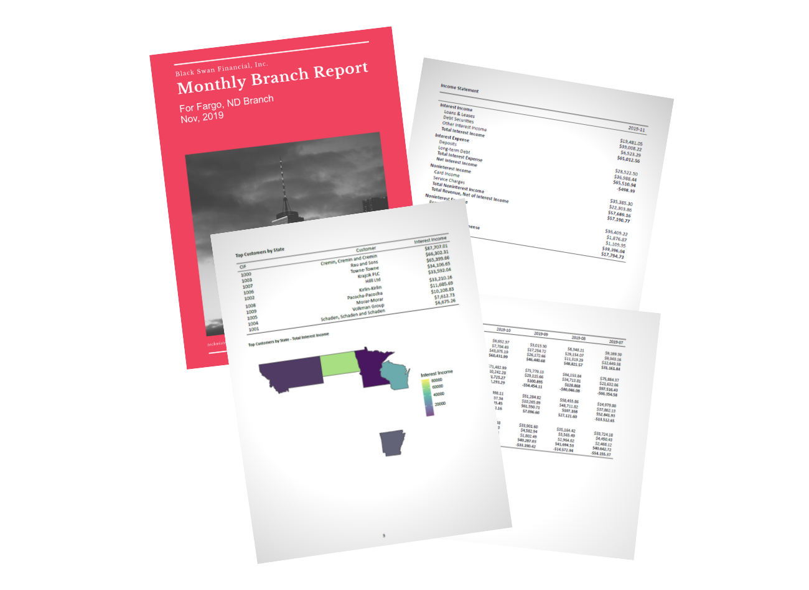

<!-- README.md is generated from README.Rmd. Please edit that file -->

# Professional Financial Reports with {rmarkdown}



<!-- badges: start -->

<!-- badges: end -->

## About

This is the companion repository for the lightning talk given December 9th, 2020. [LINK HERE](https://zoom.us/rec/share/7pRIYhe89H5cNzkwyEgNx2EBU9K0mzYCW3oH_RmRiqWTNJiTmD3n6TrYBgqc2Hwo.j4IdWV8SBW3s1wFc ), password: { 9np$u.=p }

[Meetup link](https://www.meetup.com/RStudio-Enterprise-Community-Meetup/events/274718908/)


## Installation

Getting rmarkdown to work correctly is always a struggle for me, there
are a lot of moving parts. Don’t be discouraged if you can’t get this
repo working immediately. Keep debugging and send me a message if you
get stuck.

### {renv}

The renv package was used to create and maintain the environment for
this project. First install this package if you haven’t already

``` r
install.packages("renv")
```

When you open the project associated with this repo (after installing
renv), it should activate the renv. Check this with

``` r
renv::status()
```

Next, install the dependencies needed to run this code with

``` r
renv::restore()
```

### OS Issues

This project was created on Win10, with R version 4.0.2. If you install
this on Linux or Mac, you may have an issue with the fonts used on
R/rmarkdown/report\_master.Rmd. The mainfont in the yaml header needs to
be changed to a font you have installed. Ubuntu is a font option for
Ubuntu-based distros. I used Calibri on my win10 machine.

On Ubuntu, you will more than likely have to install the magick++
package with an *apt* command, the output from renv::restore() should
tell you what you need to do.

## Tutorial

The goal here is to create parameterized (param’d) reports for a
financial institution that has three branches. We want to:

  - Read financial data from a SQL database
  - Create various tables and charts in an rmarkdown document
  - Knit the document to a pdf that can be distributed to whomever

You can run the reports from the terminal with

``` bash
Rscript R/main.R
```

or you can run main.R from the R repl. This should place three pdfs in
the [/finished\_reports/](/finished_reports) folder.

### Key packages


Rmarkdown will knit our PDF packets and KableExtra will help us format
our financial tables. Renv will help us maintain our environment and
glue will be very helpful in parameterizing our reports and strings.

### Get financial data from SQL


The [data-raw/fake.R](data-raw/fake.R) script creates fake financial
data for us with the [charlatan](https://github.com/ropensci/charlatan/)
R package. Then it writes a few tables to a local SQLite db. We will
ping this database in our example, but you could obviously connect to
any data with this method.

### Create rmarkdown

Our main rmarkdown document is what I’ll call a “parent”, with several
children rmarkdown files.
[R/rmarkdown/report\_master.Rmd](R/rmarkdown/report_master.Rmd) knits
together various children rmarkdown docs located in
[R/rmarkdown](R/rmarkdown).

We rely on the [kableExtra](https://haozhu233.github.io/kableExtra/)
package heavily at this stage. A good tutorial for using kableExtra with
pdf output can be found
[here](https://haozhu233.github.io/kableExtra/awesome_table_in_pdf.pdf).

### Knit to pdf(s)

The last step is to iterate over the three branches in our example, and
create a report for each, given the parameter: branch.

[R/main.R](R/main.R) is the file that runs our actual process. First it
sources our [R/setup.R](R/setup.R) file and then constructs a function
to knit a pdf for each branch given the *branch* parameter.

If you run [R/main.R](R/main.R), at this point you should have three
pdfs in [finished\_reports](finished_reports).

## Contact

Reach out to me at bradley.lindblad\[at\]gmail.com or my website
[technistema.com](https://technistema.com).
